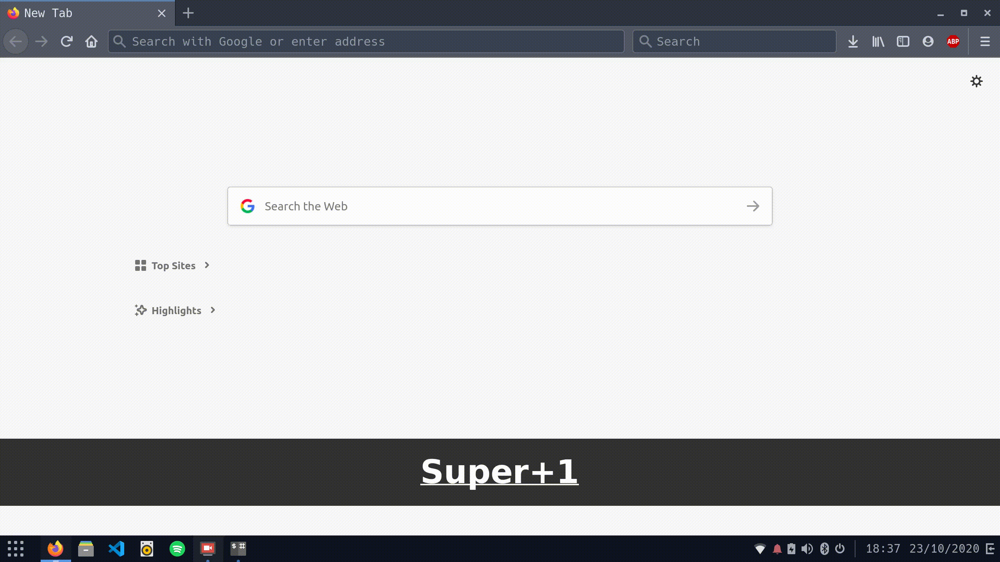

# Budgie-Super-Key-Launcher

(Super) Dirty, three lines workaround for using Budgie Desktop with Super + 1, Super + 2 ... Window key binding: 

 

0-) Install wmctrl 
 

1-) Download SuperKey.sh  and check if set as an executable.
 

2-) Inside it, replace all "Your_program" instances with the name of the program you want. 

2.1-) Be aware: replace "Your_program" with your program name starting with CAPITAL letters. And "your_program" with lower case program name.  
 

3-) Set the keyboard shortcut for the position you want. Eg: In Budgie, Firefox is the first program on my window list. So I'm going to the key binding Super+1 to the path to SuperKey.sh
 

4-) Repeat the process for your pinned applications (it will not work for unpinned applications, as this script is very simple and doesn't really know the position of the icons in the taskbar). But it would be a nice addition. 
 
